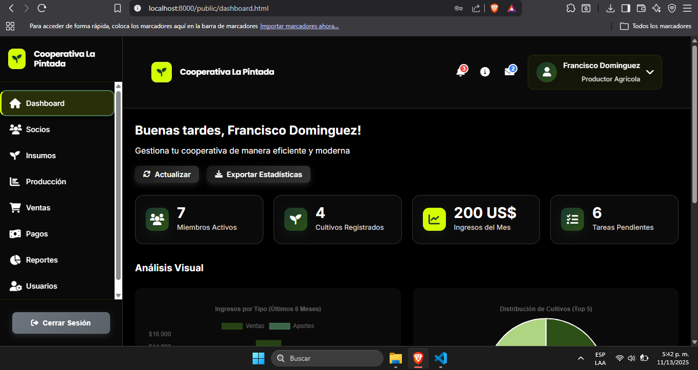
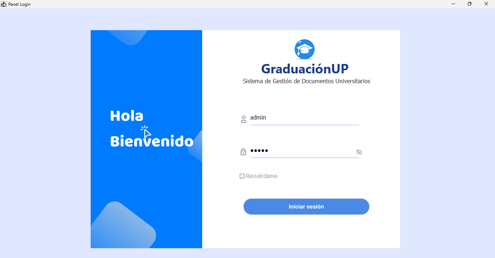

<div align="center">
  
# 👋 Hola, Soy Francisco Domínguez

### Estudiante de Ingeniería en Informática | Universidad de Panamá 🇵🇦


</div>

## 💼 ¿Quién Soy?

Soy estudiante de **4° año de Ingeniería en Informática** con enfoque en el **desarrollo de software**, **bases de datos**, **creación de aplicaciones**, **soporte técnico** y **mantenimiento preventivo/correctivo** de equipos.

Me apasiona desarrollar soluciones reales que optimicen procesos, integren datos y resuelvan problemas mediante tecnología.

## 🧠 Lo que Sé Hacer

<table>
<tr>
<td width="50%" valign="top">

**🖥️ Desarrollo de Software**
- Apps de escritorio con **Java (Swing + MVC)**
- Aplicaciones web con **HTML, CSS, JS, PHP**
- Lógica de negocio y patrones de diseño
- Interfaces intuitivas y funcionales

</td>
<td width="50%" valign="top">

**🗄️ Bases de Datos**
- Diseño y normalización profesional
- **MySQL & PostgreSQL**
- Triggers, vistas, procedimientos
- Optimización de consultas

</td>
</tr>
<tr>
<td width="50%" valign="top">

**📱 Apps Empresariales**
- Sistemas multi-usuario con roles
- Control de inventarios y finanzas
- Generación de reportes dinámicos
- Validaciones y seguridad

</td>
<td width="50%" valign="top">

**🛠️ Plus Técnico**
- Git & GitHub
- Soporte y mantenimiento de PC
- Configuración de redes
- Documentación técnica

</td>
</tr>
</table>

## 🚀 Stack Tecnológico

<p align="center">
  
  
  
  
  
  
  
  
  
</p>

## 🌟 Proyectos Destacados

### 🌾 Sistema de Gestión Agrícola
**Cooperativa Agrícola La Pintada**

Sistema web integral para la administración de cooperativas agrícolas

```
✓ 4 tipos de usuarios con roles        ✓ Control de inventario inteligente
✓ Dashboard con datos en tiempo real   ✓ Sistema completo de reportes
✓ Módulo financiero automatizado        ✓ Gestión de socios y productores
```

**Tech Stack:** HTML · CSS · JavaScript · PHP · MySQL

<div align="center">
  
  
</div>

### 📄 Control de Documentos — Universidad de Panamá 🇵🇦
**Sistema de Recepción Académica**

Aplicación de escritorio para la gestión y seguimiento de documentos universitarios

```
✓ Arquitectura MVC profesional          ✓ Panel administrativo completo
✓ Gestión de usuarios y permisos        ✓ Notificaciones automáticas
✓ Tracking de trámites en tiempo real   ✓ Generación de reportes
```

**Tech Stack:** Java · Swing · MySQL · JDBC

<div align="center">
  
  
</div>

<div align="center">

## 📫 Conecta Conmigo

<a href="https://www.linkedin.com/in/francisco-dominguez-77953b33a/" target="blank">
  
</a>
<a href="https://www.instagram.com/fldv.10/" target="blank">
  
</a>
<a href="https://leetcode.com/u/fran234/" target="blank">
  
</a>

## 💬 ¿Colaboramos?

Abierto a proyectos, prácticas profesionales y oportunidades de desarrollo.

**Contáctame via Issues · Discussions · Redes Sociales**

### ⚡ *"Estudiante hoy, ingeniero mañana. Programador siempre."* ⚡

**Desarrollado con 💙 por Francisco Domínguez**

</div>
